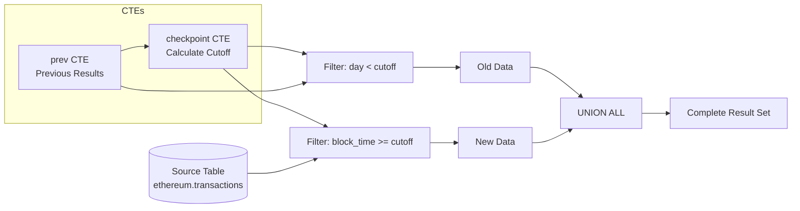

Every time you refresh a dashboard or re-run a scheduled query, Dune typically scans **all** historical data from scratch—even though most of that data hasn't changed. For a query calculating daily Ethereum transaction stats going back to 2020, this means:

- Rescanning 4+ years of immutable data
- Costing 100+ credits per run
- Taking 20+ minutes to execute
- When only the last day's data is actually new

**Incremental Queries** solve this by letting you reference your previous results and query only the new data since your last run. The result: **~100x cheaper and faster** execution for recurring queries.

<Info>
For complex data transformation pipelines with testing, CI/CD, and version control, see the [dbt Connector](/api-reference/connectors/dbt-connector). Incremental Queries are ideal for simpler dashboard updates using pure SQL.
</Info>

## How It Works

When you run a query on Dune, your results are stored. With Incremental Queries, you can reference those stored results in your next run using a special table function.

```
First run:  No previous results → Query all historical data → Store results
Second run: Load previous results → Query only new data → Combine & store
Third run:  Load previous results → Query only new data → Combine & store
...and so on
```

Dune handles storing and retrieving your previous results automatically. You write SQL that says "give me my previous results" and "get me new data since then."

### The Table Function

The `TABLE(previous.result(...))` function returns your previous query results:

- **First run**: Returns an empty table (0 rows) with your specified schema
- **Subsequent runs**: Returns all data from your previous execution

The schema is defined using `DESCRIPTOR()` which specifies the column names and types:

```sql
SELECT * FROM TABLE(previous.result(
    schema => DESCRIPTOR(
        day TIMESTAMP(3),
        tx_count BIGINT,
        total_gas BIGINT
    )
))
```

## The Pattern

Here's the standard incremental query pattern:

```sql
WITH prev AS (
    -- 1. Load previous results (empty on first run)
    SELECT * FROM TABLE(previous.result(
        schema => DESCRIPTOR(
            day TIMESTAMP(3),
            tx_count BIGINT,
            total_gas BIGINT
        )
    ))
),
checkpoint AS (
    -- 2. Find where we left off (with 1-day lookback for incomplete data)
    SELECT COALESCE(MAX(day), TIMESTAMP '2020-01-01') - INTERVAL '1' DAY AS cutoff
    FROM prev
)
-- 3. Keep old data (before cutoff)
SELECT day, tx_count, total_gas
FROM prev
WHERE day < (SELECT cutoff FROM checkpoint)

UNION ALL

-- 4. Compute new data (from cutoff onwards)
SELECT
    date_trunc('day', block_time) AS day,
    COUNT(*) AS tx_count,
    SUM(gas_used) AS total_gas
FROM ethereum.transactions
WHERE block_time >= (SELECT cutoff FROM checkpoint)
GROUP BY 1

ORDER BY day
```

The following diagram shows how data flows through the query pattern:



### Pattern Components

| Component | Purpose |
|-----------|---------|
| `prev` CTE | Loads your previous query results. Returns 0 rows on first run. |
| `checkpoint` CTE | Finds the max timestamp from previous results. Uses a default if no previous data exists. The lookback ensures incomplete periods get recomputed. |
| First SELECT | Keeps historical data that doesn't need recomputing (before the cutoff). |
| Second SELECT | Queries only new/recent data from the source table (from cutoff onwards). |
| UNION ALL | Combines old + new into your complete result set. |

## When to Use Incremental Queries

### Great For

- **Scheduled queries** that run daily or hourly
- **Dashboard refreshes** that update visualizations with new data
- **Time-series aggregations** (daily stats, hourly metrics)
- **Append-only data** (transactions, events, transfers)
- **Cumulative metrics** that build over time

### Not Ideal For

- **Ad-hoc exploratory queries** (one-time runs don't benefit)
- **Queries where historical data changes** (non-append-only sources)
- **Complex multi-way joins** that can't be easily partitioned by a checkpoint column

## Key Patterns

### Lookback Windows

The lookback window ensures incomplete time periods get recomputed. Choose based on your aggregation granularity:

```sql
-- Daily aggregations: 1-day lookback
SELECT COALESCE(MAX(day), TIMESTAMP '2020-01-01') - INTERVAL '1' DAY AS cutoff

```

### Default Checkpoint Values

Use `COALESCE` to provide a sensible default for the first run when no previous results exist:

```sql
-- Start of your data interest period
COALESCE(MAX(day), TIMESTAMP '2020-01-01')

-- Block number checkpoint
COALESCE(MAX(block_number), 0)
```

## Example Queries

### Example 1: Daily Transaction Aggregations

Track daily Ethereum transaction statistics with automatic incremental updates:

```sql
WITH prev AS (
    SELECT * FROM TABLE(previous.result(
        schema => DESCRIPTOR(
            day TIMESTAMP(3),
            tx_count BIGINT,
            total_gas BIGINT
        )
    ))
),
checkpoint AS (
    SELECT COALESCE(MAX(day), TIMESTAMP '2015-07-30') - INTERVAL '1' DAY AS cutoff
    FROM prev
)
SELECT day, tx_count, total_gas FROM prev WHERE day < (SELECT cutoff FROM checkpoint)

UNION ALL

SELECT
    date_trunc('day', block_time) as day,
    COUNT(*) as tx_count,
    SUM(gas_used) as total_gas
FROM ethereum.transactions
WHERE block_time >= (SELECT cutoff FROM checkpoint)
GROUP BY 1

ORDER BY day
```

**First run**: Scans all historical data (expensive, but only happens once).

**Every subsequent run**: Only scans the last day or so of data (cheap and fast).

### Example 2: Hourly Gas Price Statistics

Track gas price percentiles by hour:

```sql
WITH prev AS (
    SELECT * FROM TABLE(previous.result(
        schema => DESCRIPTOR(
            hour TIMESTAMP(3),
            min_gwei DOUBLE,
            p50_gwei DOUBLE,
            p95_gwei DOUBLE,
            max_gwei DOUBLE,
            tx_count BIGINT
        )
    ))
),
checkpoint AS (
    SELECT COALESCE(MAX(hour), TIMESTAMP '2015-07-30') - INTERVAL '1' HOUR AS cutoff
    FROM prev
)
-- Historical stats (before lookback window)
SELECT hour, min_gwei, p50_gwei, p95_gwei, max_gwei, tx_count
FROM prev
WHERE hour < (SELECT cutoff FROM checkpoint)

UNION ALL

-- Recompute recent hours (including potentially incomplete last hour)
SELECT
    date_trunc('hour', block_time) AS hour,
    MIN(gas_price / 1e9) AS min_gwei,
    APPROX_PERCENTILE(gas_price / 1e9, 0.5) AS p50_gwei,
    APPROX_PERCENTILE(gas_price / 1e9, 0.95) AS p95_gwei,
    MAX(gas_price / 1e9) AS max_gwei,
    COUNT(*) AS tx_count
FROM ethereum.transactions
WHERE block_time >= (SELECT cutoff FROM checkpoint)
GROUP BY 1

ORDER BY hour
```

### Example 3: Cumulative Sums

For cumulative metrics, the pattern is slightly different: select only the base values from previous results and recompute the cumulative over the combined data.

```sql
WITH prev AS (
    SELECT * FROM TABLE(previous.result(
        schema => DESCRIPTOR(
            day DATE,
            eth_received DOUBLE,
            cumulative_received DOUBLE
        )
    ))
),
checkpoint AS (
    SELECT COALESCE(MAX(day), DATE '2015-07-30') - INTERVAL '1' DAY AS cutoff
    FROM prev
)
SELECT
    day,
    eth_received,
    SUM(eth_received) OVER (ORDER BY day) AS cumulative_received
FROM (
    -- Old daily values (drop the old cumulative, we'll recompute it)
    SELECT day, eth_received
    FROM prev
    WHERE day < (SELECT cutoff FROM checkpoint)

    UNION ALL

    -- New daily values
    SELECT
        CAST(date_trunc('day', block_time) AS DATE) AS day,
        SUM(value / 1e18) AS eth_received
    FROM ethereum.traces
    WHERE "to" = 0xd8dA6BF26964aF9D7eEd9e03E53415D37aA96045
        AND success = TRUE
        AND block_time >= (SELECT cutoff FROM checkpoint)
    GROUP BY 1
)
ORDER BY day
```

**Key insight**: We only select `day` and `eth_received` from previous results—NOT the old `cumulative_received`. Then we recompute the cumulative over the combined data. This is simpler and more reliable than trying to "continue" from the last cumulative value.

## Incremental Queries vs dbt Connector

The [dbt Connector](/api-reference/connectors/dbt-connector) is Dune's full-featured solution for production data pipelines. It provides everything data teams need: multiple incremental strategies (merge, delete+insert, append), built-in testing, auto-generated documentation, Git version control, and CI/CD integration with tools like GitHub Actions and Airflow.

**Incremental Queries give you a taste of that power with zero setup.** They provide the core incremental processing capability—referencing previous results and querying only new data—using pure SQL patterns you already know.

### When to Use Each

**Use Incremental Queries when:**
- You want immediate cost savings with no setup
- You're updating dashboards or running scheduled queries
- Your logic fits in a single query
- You don't need formal testing or CI/CD

**Use the [dbt Connector](/api-reference/connectors/dbt-connector) when:**
- You're building production data pipelines
- You need data quality tests and validation
- Multiple team members collaborate on transformations
- You want Git-based version control and PR reviews
- You need to chain multiple dependent transformations
- You require audit trails and documentation

### Feature Comparison

| Capability | Incremental Queries | dbt Connector |
|------------|---------------------|---------------|
| Incremental processing | Single pattern | 3 strategies (merge, delete+insert, append) |
| Setup required | None | dbt project configuration |
| Data quality testing | Manual | Built-in framework |
| Documentation | Manual | Auto-generated |
| Version control | Dune query versioning | Full Git integration |
| CI/CD pipelines | Not supported | GitHub Actions, Airflow, etc. |
| Model dependencies | Not supported | Automatic ordering |
| Availability | All users | Enterprise |

For most dashboard and reporting use cases, Incremental Queries provide excellent cost savings. For production analytics infrastructure, the [dbt Connector](/api-reference/connectors/dbt-connector) is the industry-standard choice.

## Tips and Best Practices

### Choose Appropriate Lookback Windows

Match your lookback window to your aggregation granularity and data characteristics:
- Daily aggregations typically need 1-day lookback
- Hourly metrics need 1-hour lookback
- TVL calculations might need 7-day lookback due to price changes and rebalancing

### Align Checkpoints with Partitions

Dune tables are partitioned by `block_date` or `block_time`. Using time-based checkpoints enables efficient partition pruning:

```sql
-- Good: Aligns with partition column
WHERE block_time >= (SELECT cutoff FROM checkpoint)

-- Also good: Using block_date directly
WHERE block_date >= CAST((SELECT cutoff FROM checkpoint) AS DATE)
```

### First Run Costs

The first run of an incremental query processes all historical data and will be expensive. Subsequent runs will be dramatically cheaper. Plan accordingly:
- Run the initial query during off-peak hours if possible
- Consider the first run cost as a one-time investment

### Schema Consistency

Ensure your `DESCRIPTOR` schema exactly matches the columns and types your query produces. Mismatches will cause errors:

```sql
-- Schema must match query output exactly
schema => DESCRIPTOR(
    day TIMESTAMP(3),      -- Matches date_trunc output
    tx_count BIGINT,       -- Matches COUNT(*) output
    total_gas BIGINT       -- Matches SUM(gas_used) output
)
```
