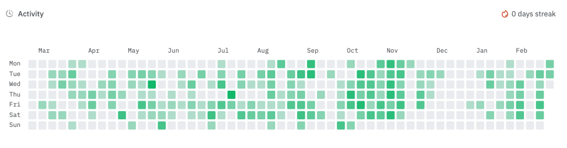

# How Activity is Measured

Activity on Dune is measured by combining different types of contributions:

### Query Activity

- Creating new queries (including temp queries)
- Updating existing queries
- Deleting queries

### Dashboard Activity

- Creating new dashboards

### Contract Activity

- Submitting new contracts

## Contributions Calculation

Each action counts as one contribution for that day. For example, if you:

- Create 2 queries
- Update 1 query
- Create 1 dashboard
- Submit 1 contract

Your total activity for that day would be 5 contribution.

The activity heatmap shows your daily activity over time, helping you track your contributions to the Dune ecosystem.
